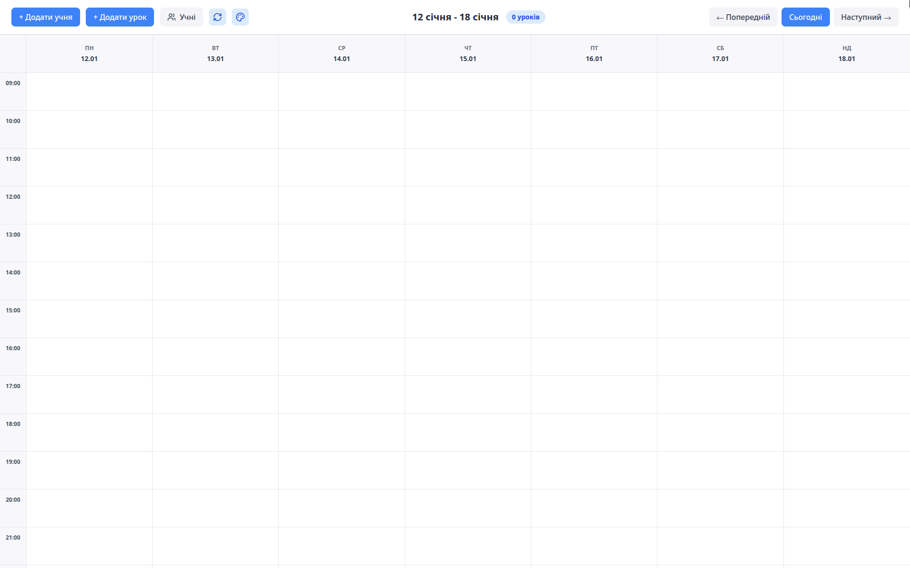
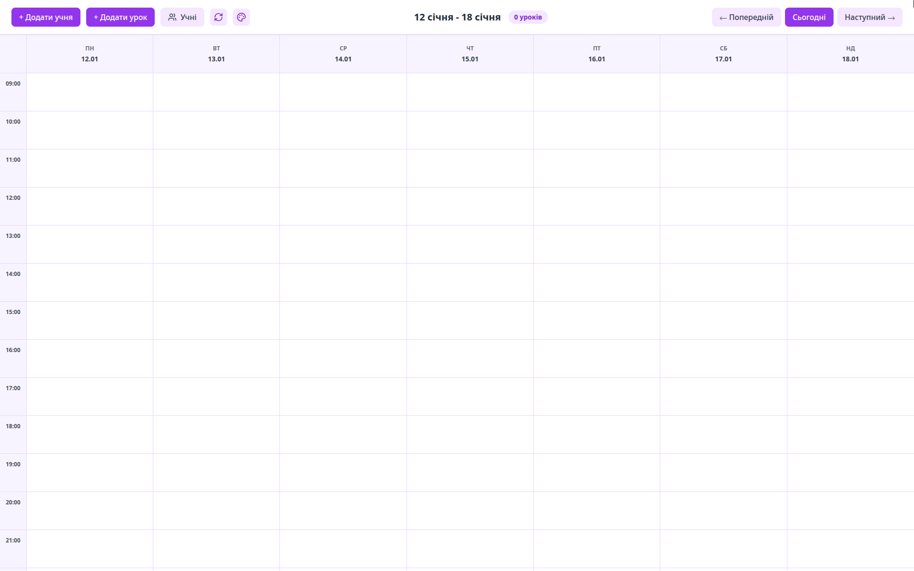
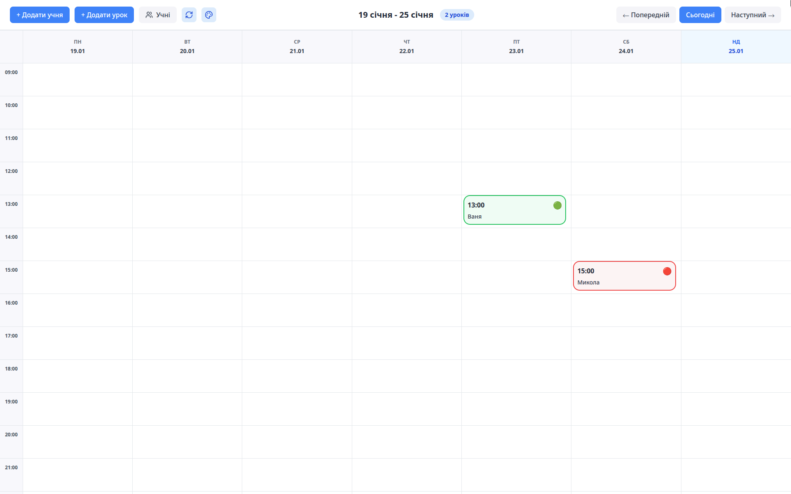
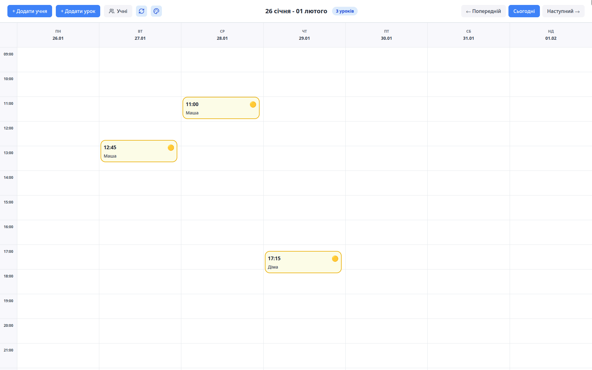
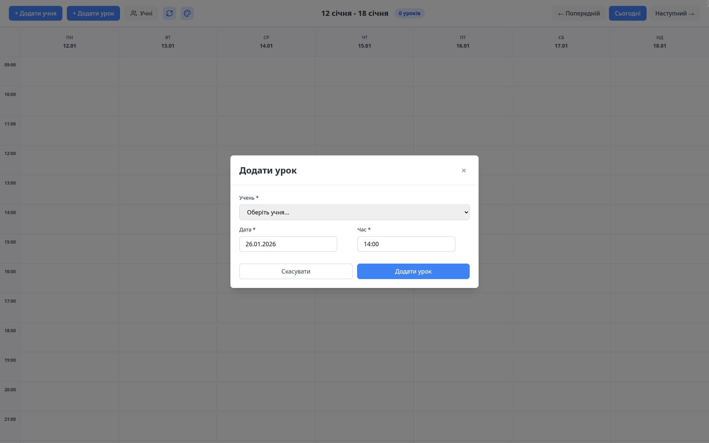
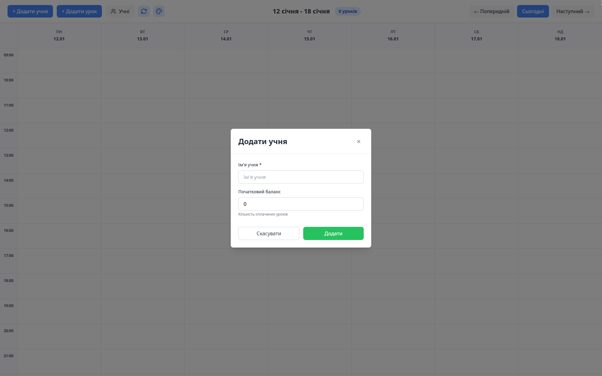
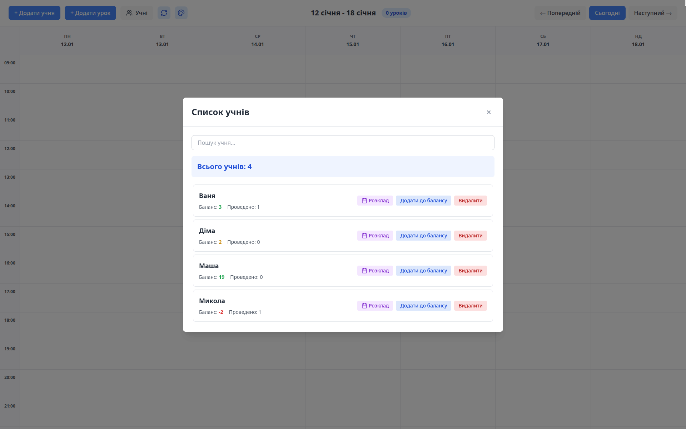
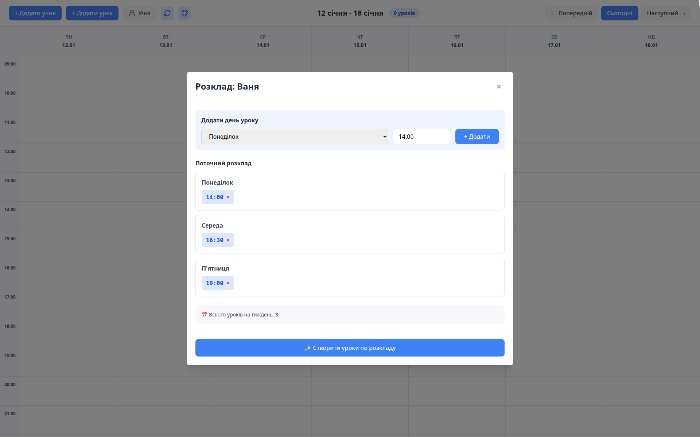

# Student Manager

## 📑 Table of Contents

- [📖 About the Project](#-about-the-project)
  - [Key Features](#key-features)
  - [📸 Screenshots](#-screenshots)
- [🛠 Technologies](#-technologies)
- [📦 Installation and Setup](#-installation-and-setup)
  - [Prerequisites](#prerequisites)
  - [Installing Dependencies](#installing-dependencies)
  - [Development Mode](#development-mode)
- [🏗 Building the Application](#-building-the-application)
  - [Windows](#windows)
  - [Linux](#linux)
  - [Universal Build](#universal-build)
- [📁 Project Structure](#-project-structure)
- [💾 Database](#-database)
  - [Database Schema](#database-schema)
- [🔧 Available Commands](#-available-commands)
- [🐛 Debugging and Development](#-debugging-and-development)
- [👨‍💻 Author](#-author)

---

## 📖 About the Project

**Student Manager** is a desktop application for managing students and lesson scheduling. Built with Electron + React, it's designed for tutors and teachers who need to:

- Manage student database
- Schedule individual lessons
- Track student balances (payments/debts)
- Keep records of completed and scheduled lessons
- Create recurring schedules for students

> **Note:** The application interface is in **Ukrainian** language.

## 📸 Screenshots

### Calendar


### Calendar (Purple Theme)


### Calendar with Lessons



### Add Student


### Add Lesson


### Student List


### Schedule


---

### Key Features

✅ **Student Management**
- Add, edit, and delete students
- Track each student's balance
- View lesson history

✅ **Lesson Calendar**
- Weekly view with lessons
- Visual lesson statuses (scheduled, completed, paid, overdue)
- Quick lesson adding and editing

✅ **Scheduling**
- Create recurring schedules for each student
- Automatic lesson generation based on schedule
- Flexible schedule management (activate/deactivate)

✅ **Automatic Accounting**
- Balance synchronization when marking lessons as completed
- Automatic detection of overdue lessons
- Secure local data storage using SQLite database

✅ **Visual Customization**
- Beautiful purple theme for a modern and pleasant interface
- Elegant color scheme that reduces eye strain
- Intuitive visual design for better user experience

---

## 🛠 Technologies

- **Electron** 40.0.0 — desktop framework
- **React** 19.2.3 — UI library
- **Vite** 7.3.1 — build tool and dev server
- **Tailwind CSS** 3.4.19 — styling
- **Better-SQLite3** 12.6.2 — local database
- **Zustand** 5.0.10 — state management
- **date-fns** 4.1.0 — date utilities
- **Lucide React** — icons

---

## 📦 Installation and Setup

### Prerequisites

- **Node.js** version 18 or higher
- **npm** or **yarn**
- **Python** (for building native modules)
- **Build tools** for your OS:
  - **Windows**: Visual Studio Build Tools or Windows SDK
  - **Linux**: `build-essential`, `python3`, `make`, `g++`

### Installing Dependencies

```bash
# Clone the repository
git clone https://github.com/Danylo37/student-manager
cd student-manager

# Install dependencies
npm install

# Rebuild native modules for Electron
npm run rebuild
```

### Development Mode

```bash
npm run dev
```

This command will start:
- Vite dev server on `http://localhost:5173`
- Electron application with hot-reload

---

## 🏗 Building the Application

### Windows

```bash
# Build frontend
npm run build

# Create Windows installer
npm run package:win
```

**Output:** Executable `.exe` installer in `release/` folder

**Windows Requirements:**
- Visual Studio Build Tools 2017 or newer
- Windows SDK (usually included in Visual Studio Build Tools)

Install Build Tools with:
```bash
npm install --global windows-build-tools
```

### Linux

```bash
# Build frontend
npm run build

# Create Linux packages
npm run package:linux
```

**Output:** 
- `.AppImage` — universal format for all distributions
- `.deb` — for Ubuntu/Debian-based systems

In `release/` folder

**Linux Requirements:**
```bash
# Debian/Ubuntu
sudo apt-get install build-essential python3 make g++

# Fedora/RHEL
sudo dnf install gcc-c++ make python3

# Arch Linux
sudo pacman -S base-devel python
```

### Universal Build

```bash
# Build for current platform
npm run build
npm run package
```

---

## 📁 Project Structure

```
student-manager/
├── .git/                       # Git repository
├── .gitignore                  # Git ignore rules
├── .idea/                      # IDE configuration (WebStorm/IntelliJ)
├── .prettierrc                 # Prettier configuration
├── README.md                   # Project documentation
│
├── attachments/                # Screenshots for README
│   ├── 1_calendar.png
│   ├── 2_calendar_purple_theme.png
│   ├── 3_calendar_with_lessons_1.png
│   ├── 4_calendar_with_lessons_2.png
│   ├── 5_add_student.png
│   ├── 6_add_lesson.png
│   ├── 7_student_list.png
│   └── 8_schedule.png
│
├── build/                      # Build resources
│   ├── icon.ico                # Icon for Windows
│   └── icon.png                # Icon for Linux
│
├── main/                       # Electron main process
│   ├── main.js                 # Electron entry point
│   ├── preload.js              # Preload script for IPC
│   ├── database.js             # SQLite database and API
│   ├── logger.js               # Application logging
│   ├── constants.js            # Application constants
│   └── db/
│       └── schema.sql          # Database schema
│
├── node_modules/               # NPM dependencies
│
├── src/                        # React application
│   ├── App.jsx                 # Main component
│   ├── main.jsx                # React entry point
│   ├── index.css               # Global styles
│   │
│   ├── components/             # React components
│   │   ├── Calendar/           # Calendar and scheduling
│   │   │   ├── WeekView.jsx    # Weekly view
│   │   │   ├── DayColumn.jsx   # Day column
│   │   │   └── LessonCard.jsx  # Lesson card
│   │   │
│   │   ├── Header/             # Application header
│   │   │   └── Header.jsx      # Navigation and actions
│   │   │
│   │   ├── Modals/             # Modal windows
│   │   │   ├── Modal.jsx               # Base modal
│   │   │   ├── AddStudentModal.jsx     # Add student
│   │   │   ├── AddLessonModal.jsx      # Add lesson
│   │   │   ├── EditLessonModal.jsx     # Edit lesson
│   │   │   ├── StudentsListModal.jsx   # Students list
│   │   │   └── ScheduleModal.jsx       # Schedule management
│   │   │
│   │   └── common/             # Common components
│   │       ├── DateTimePicker.jsx
│   │       └── DateTimePicker.css
│   │
│   ├── hooks/                  # React hooks
│   │   ├── useStudents.ts      # Students management
│   │   ├── useLessons.ts       # Lessons management
│   │   ├── useBalanceSync.ts   # Balance synchronization
│   │   └── useLessonTimers.ts  # Lesson timers management
│   │
│   ├── store/                  # State management
│   │   └── appStore.ts         # Zustand store
│   │
│   ├── types/                  # TypeScript type definitions
│   │   └── index.ts            # Common types and interfaces
│   │
│   └── utils/                  # Utilities
│       ├── constants.ts        # Application constants
│       ├── dateHelpers.ts      # Date utilities
│       └── lessonStatus.ts     # Lesson statuses
│
├── package.json                # NPM configuration
├── package-lock.json           # NPM lock file
├── index.html                  # HTML template
├── tsconfig.json               # TypeScript configuration
├── tsconfig.node.json          # TypeScript Node configuration
├── vite.config.ts              # Vite configuration
├── tailwind.config.mjs         # Tailwind CSS configuration
└── postcss.config.js           # PostCSS configuration
```

---

## 💾 Database

The application uses **SQLite** for local data storage. The database is automatically created on first launch in the user data directory:

- **Windows**: `%APPDATA%/student-manager/students.db`
- **Linux**: `~/.config/student-manager/students.db`

### Database Schema

**Table `students`**
- `id` — unique identifier
- `name` — student name
- `balance` — balance (positive = overpayment, negative = debt)
- `created_at` — creation date

**Table `lessons`**
- `id` — unique identifier
- `student_id` — reference to student
- `datetime` — lesson date and time
- `previous_datetime` — previous date (when rescheduled)
- `is_completed` — completion flag
- `is_paid` — payment flag
- `created_at` — creation date

**Table `schedules`**
- `id` — unique identifier
- `student_id` — reference to student
- `day_of_week` — day of week (0-6, where 0 = Sunday)
- `time` — lesson time
- `is_active` — whether schedule is active
- `created_at` — creation date

---

## 🔧 Available Commands

```bash
# Development
npm run dev              # Run in development mode
npm run dev:vite         # Vite dev server only
npm run dev:electron     # Electron only

# Build
npm run build            # Build React application
npm run package          # Create installer for current OS
npm run package:win      # Build for Windows
npm run package:linux    # Build for Linux

# Utilities
npm run rebuild          # Rebuild native modules for Electron
```

---

## 🐛 Debugging and Development

### Issues with better-sqlite3

Если возникают ошибки с модулем `better-sqlite3`:

```bash
If you encounter errors with the `better-sqlite3` module:

```bash
# Remove node_modules and rebuild
rm -rf node_modules package-lock.json
npm install
npm run rebuild
```

### Hot Reload

In development mode, React changes are automatically applied without reloading. For changes in the Electron main process (`main/`), you need to restart the application.

---

## 👨‍💻 Author

**Danylo Lopatin**  
Email: danilofokinn@gmail.com

