# Student Manager

## 📑 Table of Contents

- [📖 About the Project](#-about-the-project)
  - [Key Features](#key-features)
  - [📸 Screenshots](#-screenshots)
    - [Calendar](#calendar)
    - [Finance](#finance)
    - [Students and Lessons](#students-and-lessons)
- [🛠 Technologies](#-technologies)
- [📦 Installation and Setup](#-installation-and-setup)
  - [Prerequisites](#prerequisites)
  - [Installing Dependencies](#installing-dependencies)
  - [Development Mode](#development-mode)
- [🏗 Building and Installing](#-building-and-installing)
  - [Windows](#windows)
  - [Linux](#linux)
  - [Cross-building Windows from Linux](#cross-building-windows-from-linux)
- [🔄 Updating an Installed App](#-updating-an-installed-app)
- [📁 Project Structure](#-project-structure)
- [💾 Database](#-database)
  - [Database Schema](#database-schema)
- [🔧 Available Commands](#-available-commands)
- [🐛 Debugging and Development](#-debugging-and-development)
- [👨‍💻 Author](#-author)

---

## 📖 About the Project

**Student Manager** is a desktop application for managing students and lesson scheduling. Built with Electron + React, it's designed for tutors and teachers who need to:

- Manage student database
- Schedule individual lessons
- Track student balances (payments/debts)
- Keep records of completed and scheduled lessons
- Create recurring schedules for students

> **Note:** The application interface is in **Ukrainian** language.

## 📸 Screenshots

### Calendar

Week view with every lesson status at once: 🟢 given and paid, 🔴 given and unpaid, 🟡 scheduled, 🔵 free trial (a half-height 30-minute card). The header carries the week total and, when taxes are on, the net beside it.

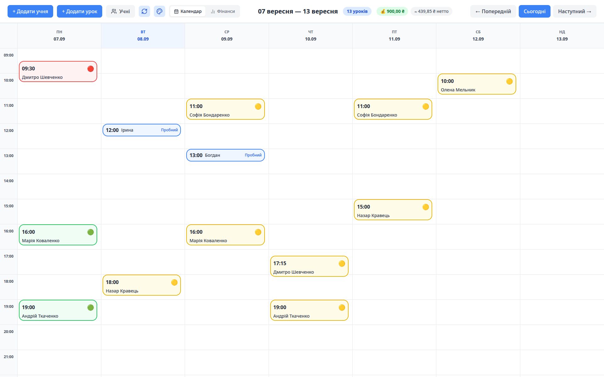

The same week in the purple theme.

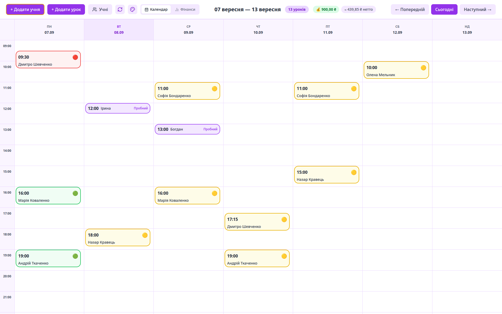

### Finance

Earnings by period with the tax breakdown: cash received (the tax base) against lessons given, minus ЄП, ВЗ and ЄСВ.

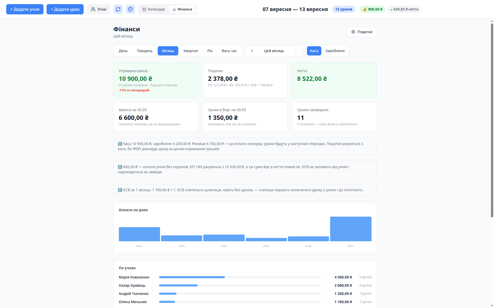

The payment history, every payment and refund in the period.

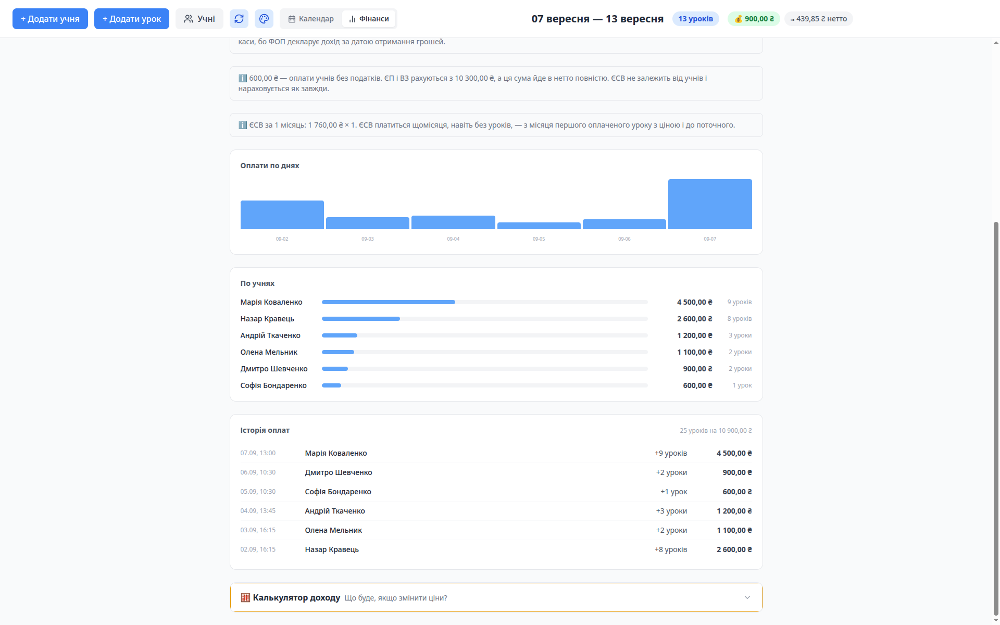

The income calculator answers "what happens if I raise prices", based on the active weekly schedule.

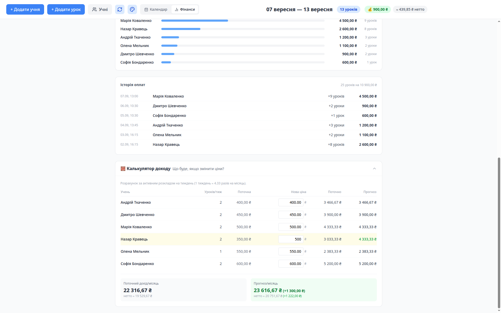

Tax settings: єдиний податок, ЄСВ and військовий збір.

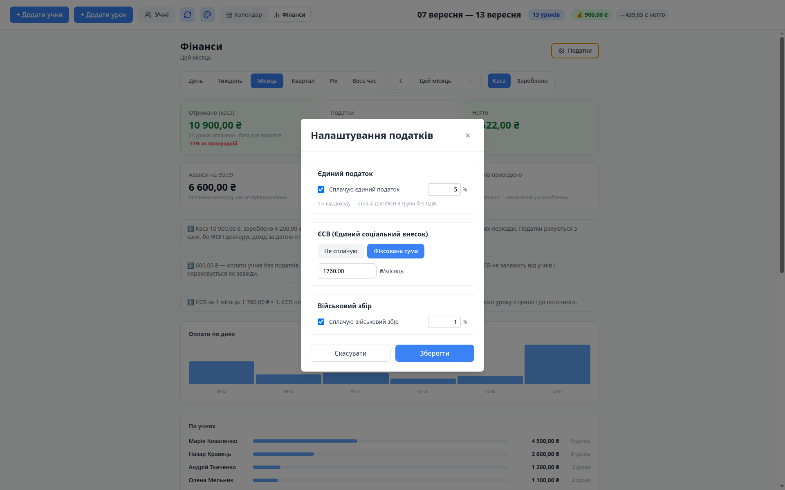

### Students and Lessons

The student list shows the balance, the price per lesson and the discount package that applies; every action lives in the row menu.

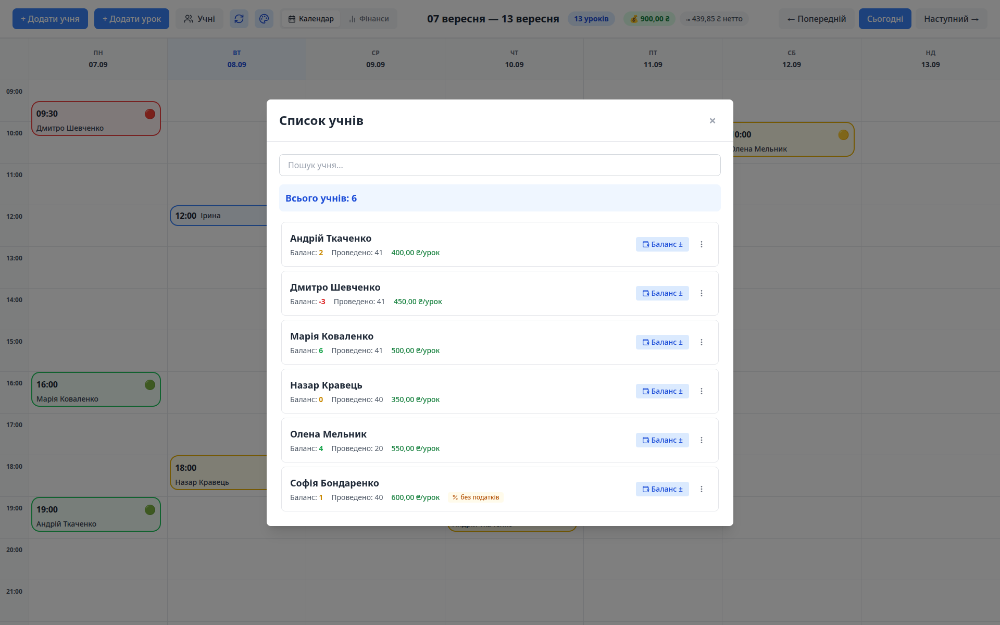

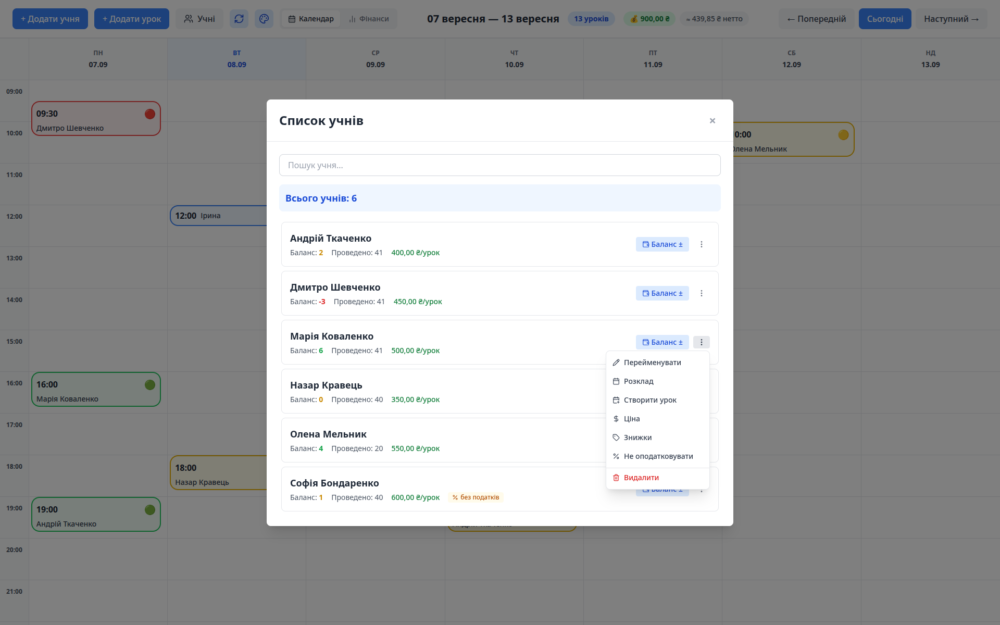

Package discounts: pay for several lessons at once at a lower price per lesson.

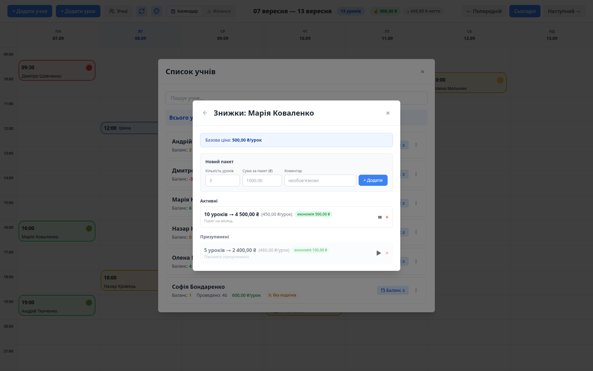

A recurring weekly schedule, and the lessons generated from it.

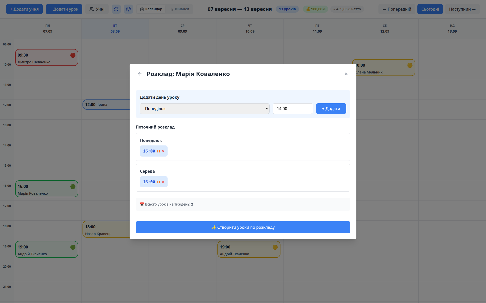

Adding a student, with the price and an optional jump straight into the schedule.

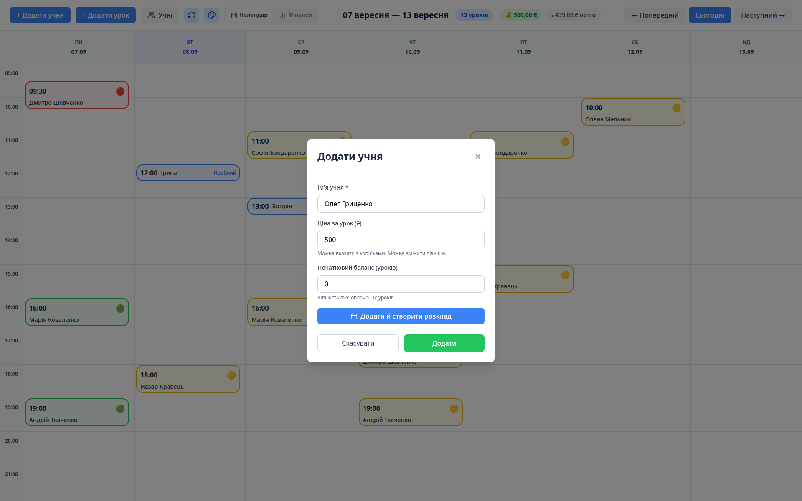

Adding a lesson, including a free 30-minute trial for someone who is not a student yet.

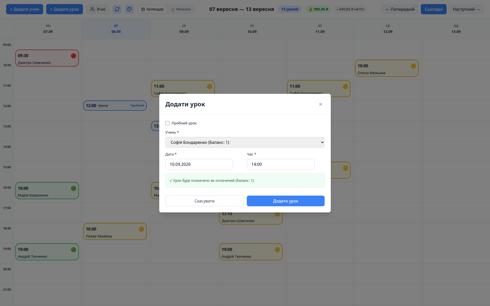

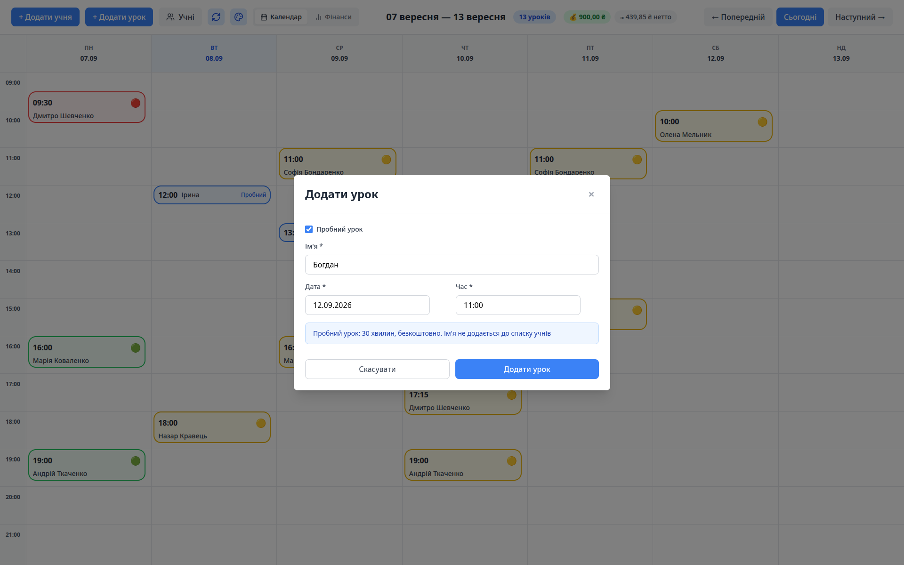

Editing a lesson: move it, rename the student, mark it paid or delete it.

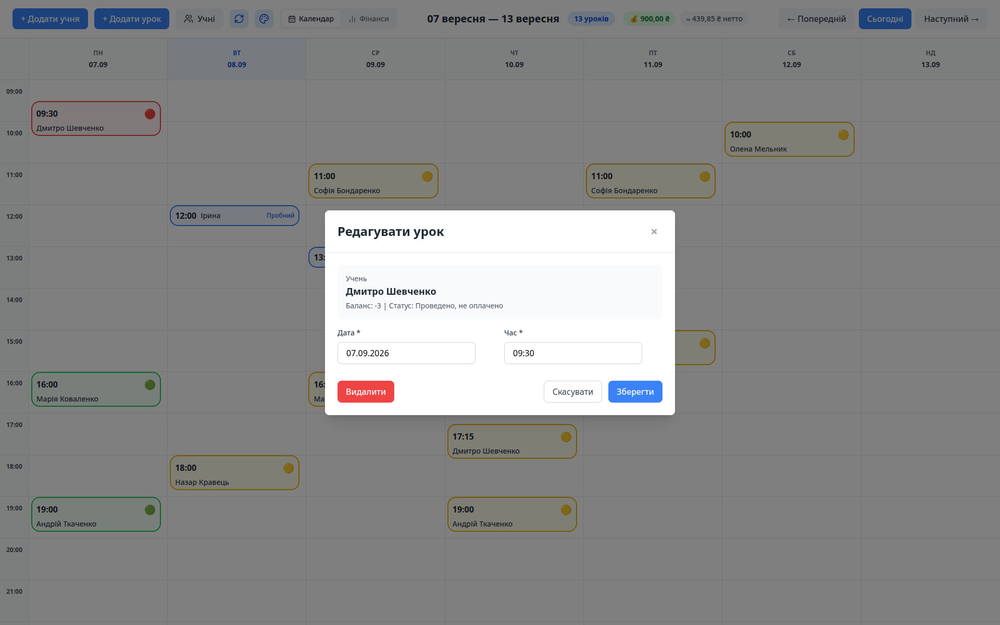

---

### Key Features

✅ **Student Management**

- Add, rename and delete students, each with a price per lesson
- Balance in lessons: a positive one is prepaid, a negative one is debt
- Price history, so a past lesson keeps the price it was given at
- Payments and refunds recorded as packages, with the lessons left to work off

✅ **Lesson Calendar**

- Weekly view with four statuses: scheduled, given and paid, given and unpaid, trial
- Free 30-minute trial lessons for someone who is not a student yet
- Mark a lesson as paid straight from its card
- Move, rename or delete a lesson from the editor

✅ **Scheduling**

- A recurring weekly schedule per student
- Lessons for the current and next week are generated from it automatically
- A slot deleted by hand is not recreated

✅ **Money and Taxes**

- Finance view with earnings by day, week, month, quarter, year or all time
- Two views of the same period: cash received (the tax base) and lessons given
- ФОП taxes: єдиний податок 5%, військовий збір 1%, fixed ЄСВ per month
- A student can be excluded from the percentage taxes
- Package discounts, for example 10 lessons for the price of 9
- Income calculator: what the month looks like if prices change
- Payment history for every period

✅ **Automatic Accounting**

- A lesson is marked as given once its time has passed
- Paying takes the oldest open slot, so payments and lessons stay in step
- A refund releases the lessons it paid for without rewriting a past tax period
- All data stays local in an SQLite database

✅ **Visual Customization**

- Standard and purple themes
- Toasts and confirmations instead of system dialogs

## 🛠 Technologies

- **Electron** 43.4.0 — desktop framework
- **React** 19.2.3 — UI library
- **Vite** 7.3.1 — build tool and dev server
- **Tailwind CSS** 3.4.19 — styling
- **Better-SQLite3** 13.0.3 — local database
- **Zustand** 5.0.10 — state management
- **date-fns** 4.1.0 — date utilities
- **Lucide React** — icons

---

## 📦 Installation and Setup

### Prerequisites

- **Node.js** version 20 or higher
- **npm** or **yarn**
- **Python** (for building native modules)
- **Build tools** for your OS:
  - **Windows**: Visual Studio Build Tools or Windows SDK
  - **Linux**: `build-essential`, `python3`, `make`, `g++`

### Installing Dependencies

```bash
git clone https://github.com/Danylo37/student-manager
cd student-manager
npm install
```

`npm install` runs `postinstall`, which rebuilds the native module `better-sqlite3` against the Electron ABI. No extra step is needed.

### Development Mode

```bash
npm run dev
```

This command will start:

- Vite dev server on `http://localhost:5173`
- Electron application with hot-reload

---

## 🏗 Building and Installing

Each block below is copy-paste ready: run it from a clean machine and you end up with the app installed.

### Windows

Install the toolchain once (PowerShell), then reopen the terminal so `PATH` picks up `git` and `node`:

```powershell
winget install Git.Git
winget install OpenJS.NodeJS.LTS
```

Build and install the app:

```powershell
git clone https://github.com/Danylo37/student-manager
cd student-manager
npm install
npm run dist:win
Start-Process (Get-ChildItem release\*.exe).FullName
```

The last line opens the generated `Student Manager Setup <version>.exe`, a regular NSIS wizard with a folder choice and Desktop / Start Menu shortcuts.

If `npm install` fails while compiling `better-sqlite3`, the prebuilt binary was unavailable and a compiler is required:

```powershell
winget install Python.Python.3.12
winget install Microsoft.VisualStudio.2022.BuildTools --override "--quiet --add Microsoft.VisualStudio.Workload.VCTools --includeRecommended"
```

> The old `npm install --global windows-build-tools` package is deprecated and no longer works on current Node versions; use the Build Tools installer above instead.

### Linux

```bash
git clone https://github.com/Danylo37/student-manager
cd student-manager
npm install
npm run install:linux
student-manager
```

`install:linux` builds an AppImage and copies it to `~/.local/bin/student-manager`, so the app starts with a single word (make sure `~/.local/bin` is in your `PATH`). AppImage bundles every library it needs, which is why it runs on any distribution, Arch included.

If you want the artifacts without installing them, use `npm run dist:linux`. It writes to `release/`:

- `.AppImage` — universal, just make it executable and run it
- `.deb` — for Ubuntu/Debian, install with `sudo apt install ./release/*.deb`

Compiler packages are only needed if the `better-sqlite3` prebuilt binary is unavailable for your platform:

```bash
sudo pacman -S base-devel python          # Arch
sudo apt-get install build-essential python3 make g++   # Debian/Ubuntu
sudo dnf install gcc-c++ make python3     # Fedora/RHEL
```

### Cross-building Windows from Linux

`npm run dist:win` can produce the `.exe` from Linux, but it needs Wine:

```bash
sudo pacman -S wine
npm run dist:win
```

Alternatively build inside the `electronuserland/builder:wine` Docker image, or simply run the Windows block above on a Windows machine.

---

## 🔄 Updating an Installed App

The app has no built-in auto-update, so an update is just a fresh build installed over the old one. The database lives outside the app (`~/.config/student-manager/students.db`, `%APPDATA%/student-manager/students.db` on Windows), so data survives every reinstall.

**Windows** (from the cloned repo):

```powershell
git pull
npm install
npm run dist:win
Start-Process (Get-ChildItem release\*.exe).FullName
```

NSIS installs over the previous version, shortcuts stay in place.

**Linux:**

```bash
git pull
npm install
npm run install:linux
```

The installed AppImage is overwritten in place, nothing else to do. For a `.deb` install run `npm run dist:linux && sudo apt install ./release/*.deb` instead.

Bump `version` in `package.json` before packaging, otherwise `apt` will not treat the package as newer and the release files keep the old name.

---

## 📁 Project Structure

```
student-manager/
├── .git/                       # Git repository
├── .gitignore                  # Git ignore rules
├── .idea/                      # IDE configuration (WebStorm/IntelliJ)
├── .prettierrc                 # Prettier configuration
├── README.md                   # Project documentation
│
├── attachments/                # Screenshots for README (01_… to 14_…)
│
├── build/                      # Build resources
│   ├── icon.ico                # Icon for Windows
│   └── icon.png                # Icon for Linux
│
├── main/                       # Electron main process
│   ├── main.js                 # Electron entry point
│   ├── preload.js              # Preload script for IPC
│   ├── database.js             # SQLite database and API
│   ├── logger.js               # Application logging
│   ├── constants.js            # Application constants
│   └── db/
│       └── schema.sql          # Database schema
│
├── node_modules/               # NPM dependencies
│
├── src/                        # React application
│   ├── App.tsx                 # Main component
│   ├── main.tsx                # React entry point
│   ├── index.css               # Global styles
│   │
│   ├── components/             # React components
│   │   ├── Calendar/           # Calendar and scheduling
│   │   │   ├── WeekView.tsx    # Weekly view
│   │   │   ├── DayColumn.tsx   # Day column
│   │   │   └── LessonCard.tsx  # Lesson card
│   │   │
│   │   ├── Header/             # Application header
│   │   │   └── Header.tsx      # Navigation and actions
│   │   │
│   │   ├── Modals/             # Modal windows
│   │   │   ├── Modal.tsx               # Base modal
│   │   │   ├── AddStudentModal.tsx     # Add student
│   │   │   ├── AddLessonModal.tsx      # Add lesson
│   │   │   ├── EditLessonModal.tsx     # Edit lesson
│   │   │   ├── StudentsListModal.tsx   # Students list
│   │   │   └── ScheduleModal.tsx       # Schedule management
│   │   │
│   │   └── common/             # Common components
│   │       ├── DateTimePicker.tsx
│   │       └── DateTimePicker.css
│   │
│   ├── hooks/                  # React hooks
│   │   ├── useStudents.ts      # Students management
│   │   ├── useLessons.ts       # Lessons management
│   │   ├── useBalanceSync.ts   # Balance synchronization
│   │   └── useLessonTimers.ts  # Lesson timers management
│   │
│   ├── store/                  # State management
│   │   └── appStore.ts         # Zustand store
│   │
│   ├── types/                  # TypeScript type definitions
│   │   └── index.ts            # Common types and interfaces
│   │
│   └── utils/                  # Utilities
│       ├── constants.ts        # Application constants
│       ├── dateHelpers.ts      # Date utilities
│       └── lessonStatus.ts     # Lesson statuses
│
├── package.json                # NPM configuration
├── package-lock.json           # NPM lock file
├── index.html                  # HTML template
├── tsconfig.json               # TypeScript configuration
├── tsconfig.node.json          # TypeScript Node configuration
├── vite.config.ts              # Vite configuration
├── tailwind.config.mjs         # Tailwind CSS configuration
└── postcss.config.js           # PostCSS configuration
```

---

## 💾 Database

The application uses **SQLite** for local data storage. The database is automatically created on first launch in the user data directory:

- **Windows**: `%APPDATA%/student-manager/students.db`
- **Linux**: `~/.config/student-manager/students.db`

### Database Schema

**Table `students`**

- `id` — unique identifier
- `name` — student name
- `balance` — balance (positive = overpayment, negative = debt)
- `created_at` — creation date

**Table `lessons`**

- `id` — unique identifier
- `student_id` — reference to student
- `datetime` — lesson date and time
- `previous_datetime` — previous date (when rescheduled)
- `is_completed` — completion flag
- `is_paid` — payment flag
- `created_at` — creation date

**Table `schedules`**

- `id` — unique identifier
- `student_id` — reference to student
- `day_of_week` — day of week (0-6, where 0 = Monday)
- `time` — lesson time
- `is_active` — whether schedule is active
- `created_at` — creation date

---

## 🔧 Available Commands

Day to day you only need these:

```bash
npm run dev              # develop with hot reload
npm run install:linux    # build and install/update the app on Linux
npm run dist:win         # build the Windows installer
```

Everything else is a building block the commands above already call:

```bash
npm run build            # compile React into dist/
npm run package          # pack dist/ + main/ into an installer for the current OS
npm run package:win      # same, forced to the Windows target
npm run package:linux    # same, forced to the Linux targets
npm run dist             # build + package for the current OS
npm run dist:linux       # build + package the AppImage and .deb
npm run dev:vite         # Vite dev server only
npm run dev:electron     # Electron window only (expects Vite to be running)
npm run rebuild          # rebuild native modules manually (npm install already does it)
```

Naming rule: `dev*` is for working on the code, `dist*` is for producing installers, and the suffix after the colon is the target platform.

---

## 🐛 Debugging and Development

### Issues with better-sqlite3

If you encounter errors with the `better-sqlite3` module:

```bash
rm -rf node_modules package-lock.json
npm install
```

### Hot Reload

In development mode, React changes are automatically applied without reloading. For changes in the Electron main process (`main/`), you need to restart the application.

---

## 👨‍💻 Author

**Danylo Lopatin**  
Email: danilofokinn@gmail.com
